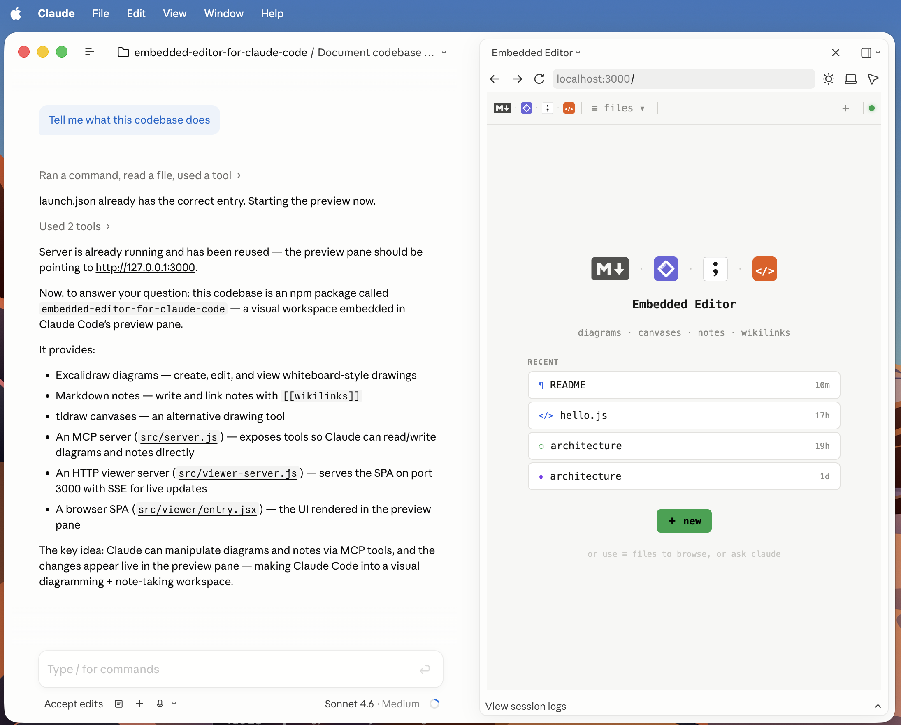
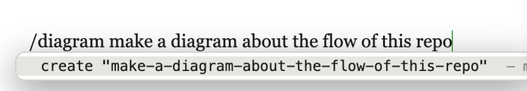

# Embedded Editor for Claude Code

An embedded visual workspace for Claude Code — edit Excalidraw diagrams, tldraw canvases, Markdown notes, and DuckDB tables in the browser preview pane, all linked together with `[[wikilinks]]`.



Claude also gets **MCP tools** to create, query, and edit all four file types inline — including authentic PNG previews for diagrams and structured table data for DuckDB files.

---

## What it does

| | |
|---|---|
| **⬡ Excalidraw** | Rough hand-drawn diagrams. Claude creates and edits them via MCP tools and sees PNG previews inline. Also fully editable in the browser. |
| **◈ tldraw** | Infinite canvas with a full shape library. Browser-only — no MCP tools needed, just open and draw. |
| **¶ Markdown** | Full CommonMark with `[[wikilinks]]`, `![[diagram embeds]]`, images, tables, code blocks, strikethrough. Frontmatter panel, note style/color picker. |
| **🦆 DuckDB** | Real embedded analytical tables. Claude creates schemas, writes rows, runs SQL queries, and creates dynamic views via MCP tools. Embed live previews with `![[name.duckdb]]`. Click column headers to sort. Click the filename to rename in place. |
| **📄 PDF** | Drop in a `.pdf` file and open it in the browser — page-by-page viewer with zoom. |
| **📊 CSV** | `.csv` files open as read-only tables with the same column-sort UI as DuckDB. |

All editors are **live-synced** via SSE — Claude's edits appear in the browser immediately and vice versa.

---

## Quick start

### Global install (recommended)

Registers the MCP server and `/editor-start` · `/editor-stop` slash commands for every project:

```sh
npx embedded-editor-for-claude-code init --global
```

Restart Claude Code, then use the slash commands in any project:

```text
/editor-start    ← starts the viewer and opens it in the preview pane
/editor-stop     ← shuts it down
```

### Per-project install (optional)

Adds a full Excalidraw element reference to `CLAUDE.md` so Claude knows the diagram API without being told. Run inside the project you want to set up:

```sh
cd your-project
npx embedded-editor-for-claude-code init
```

### Update to latest version

```sh
npx embedded-editor-for-claude-code@latest init --global
```

> Re-run `init` after upgrading to refresh the API reference in `CLAUDE.md`.

### Manual MCP registration (alternative)

If you prefer not to use `init`, add the MCP server directly:

```sh
claude mcp add --transport stdio embedded-editor -- npx -y embedded-editor-for-claude-code
```

> **Desktop app users:** installation always requires a terminal step. Run any command above in a terminal, then switch to the desktop app — it picks up the configuration automatically without a restart.

### Ask Claude to draw

> "Draw an architecture diagram of this service"  
> "Sketch the auth flow as a sequence diagram"  
> "Add a database node to the existing diagram"

Claude calls the MCP tools and returns PNG previews inline as it builds the diagram.

### DuckDB tables with a live query pane

> "Create a table tracking sprint velocity — story points planned vs delivered"

Claude creates `velocity.duckdb`, defines the schema, and seeds it with rows. Open the file in the browser and you get a full table viewer with a **slideout SQL query pane**:

```
┌─────────────────────────────────────────────────────────────────┐
│  velocity.duckdb  · 4 rows  │ ⌘ Query │ ≡ Table │ ⊞ Cards │ ↓  │
├──────────┬───────────────────────────────────────────────────────┤
│ SQL·QUERY│  sprint  │ planned │ delivered │ pct   │ status      │
│          ├──────────┼─────────┼───────────┼───────┼─────────────│
│ SELECT   │  1       │ 34      │ 29        │ 85.3% │ ⚠ Below     │
│   sprint,│  2       │ 40      │ 38        │ 95.0% │ ✓           │
│   ...    │  3       │ 36      │ 36        │ 100%  │ ✓           │
│          │  4       │ 42      │ 31        │ 73.8% │ ⚠ Below     │
│ ▶ Run ⌘↵ │                                                       │
└──────────┴───────────────────────────────────────────────────────┘
```

Click **⌘ Query** to slide the SQL editor open. Write any SQL and hit `⌘↵` — results replace the table view instantly. Switch to **⊞ Cards** for a Kanban-style board that groups rows by any column (auto-detected from `status`, `state`, `stage`, etc.) with drag-to-regroup.

Click any **column header** to sort (click again to reverse). The header turns amber and shows ▲/▼. Click the **filename** in the toolbar to rename the file in place — the tab bar, sidebar, and all wikilinks update automatically.

The toolbar also shows **"updated Xm ago"** — a timestamp updated after every `write_rows` call, equivalent to Jupyter's "last run" indicator.

Embed a live preview in any note with `![[velocity.duckdb]]` — it renders an inline table that updates whenever the data changes. The embed supports the same column sort.

---

## MCP tools

**Excalidraw diagrams**

| Tool | What it does |
|---|---|
| `list_diagrams` | List all `.excalidraw` files |
| `create_diagram` | Create a blank diagram; returns PNG preview |
| `read_diagram` | Return current JSON + PNG |
| `write_diagram` | Replace elements; returns PNG |
| `append_elements` | Add elements to existing diagram; returns PNG |
| `delete_diagram` | Delete a diagram file |

**Markdown notes**

| Tool | What it does |
|---|---|
| `list_notes` | List all `.md` notes |
| `create_note` | Create a blank note |
| `read_note` | Read note content |
| `write_note` | Write (replace) note content |
| `delete_note` | Delete a note |

**DuckDB tables**

| Tool | What it does |
|---|---|
| `list_tables` | List all `.duckdb` files |
| `create_table` | Create a new DuckDB file with an optional schema |
| `read_table` | Read rows from the first user table (returns markdown) |
| `write_rows` | Upsert rows into a table (batched — all rows in one SQL statement) |
| `delete_rows` | Delete rows matching a WHERE clause |
| `query_table` | Run arbitrary SQL; optional `save_as` inserts results into another table |
| `create_view` | Create a named DuckDB VIEW — a saved SQL query that re-executes dynamically on every read. Any column whose values match workspace file names gets a companion `_name` column with `[[wikilinks]]`; the browser renders those cells as clickable navigation links. |

**Workspace**

| Tool | What it does |
|---|---|
| `list_workspace` | List all files grouped by type in one call (diagrams, notes, tldraw, tables) |
| `rename_file` | Rename a file and rewrite all `[[wikilinks]]` |
| `get_backlinks` | Find all files that link to a given file |
| `list_history` | List saved snapshots for a diagram |
| `restore_snapshot` | Restore a diagram to a saved version |
| `list_tldraw` | List tldraw canvas files |
| `read_tldraw` | Read tldraw canvas JSON |

### How PNG rendering works

1. Claude calls `write_diagram` with Excalidraw JSON elements
2. The server writes the `.excalidraw` file
3. Excalidraw's `exportToSvg` runs in a jsdom shim — authentic SVG with rough.js strokes, hachure fills, real arrowheads
4. `@resvg/resvg-js` rasterizes to PNG
5. Returns `{type: "image", mimeType: "image/png", data: <base64>}` — Claude Code renders it inline

---

## Viewer features

- **File browser** — sidebar lists all `.excalidraw`, `.tldraw`, `.md`, `.duckdb`, `.pdf`, and `.csv` files; filter by type
- **Wikilinks** — `[[filename]]` in any editor navigates to that file as a new tab
- **Diagram embeds** — `![[diagram.excalidraw]]` in Markdown renders the diagram inline in preview
- **Image embeds** — `` works with local files; the server serves them from the project directory
- **Backlinks** — see which files link to the current one
- **Version history** — last 30 versions auto-saved; browse and restore from the history panel (`⟳`)
- **Live rename** — renaming rewrites all `[[wikilinks]]` across the project
- **Live sync** — SSE events push changes to all open tabs instantly
- **Light/dark** — follows your OS preference
- **Note style picker** — font style (Serif · Sans · Literary · Compact · Mono) and color profile (Auto · Sepia · Paper · Night · Forest) selectors in the Markdown toolbar; each setting is independent and persists across sessions
- **Frontmatter panel** — YAML front matter in notes renders as a collapsible property panel; dates, URLs, and booleans get styled display
- **External links** — because the preview pane only allows `localhost` navigation, clicking any external link copies its URL to the clipboard (a "link copied" toast confirms it)
- **Drag-to-reorder** — grab handles appear on hover for paragraphs, table rows, list items, headings (with their sections), and whole tables; drag to reorder
- **Column sort** — click any column header in DuckDB or CSV views to sort asc/desc (▲/▼); click again to reverse; numeric values sort numerically
- **Inline rename** — click the filename in a DuckDB tab or embed header to rename it in place; all wikilinks update via the server

### Slash commands

In the Markdown note editor, type `/` at the start of a line to open the command palette:



| Command | What it does |
|---|---|
| `/diagram [description]` | Creates a new Excalidraw diagram, embeds it as `![[name.excalidraw]]`, and pre-fills the prompt bar with your description so Claude populates it |
| `/canvas [description]` | Creates a new tldraw canvas and embeds it as `![[name.tldraw]]` |
| `/note [description]` | Creates a new linked Markdown note, embeds it as `[[name]]`, and pre-fills the prompt bar for Claude to write its content |
| `/table [description]` | Creates a new DuckDB table file with a slug-based name derived from the description (e.g. `/table sprint velocity` → `sprint-velocity-a3f.duckdb`), embeds it, and pre-fills the prompt bar so Claude defines the schema |
| `/query [description]` | Creates a new DuckDB file as a query result target with a slug-based name, embeds it, and pre-fills Claude to write the query SQL |
| `/link` | Opens a searchable picker of all existing files and inserts a wikilink |

**How it works:**

1. Type `/diagram` (or `/d` to narrow) — the palette shows matching commands
2. Press `Space` and type a description — the option updates to show your text
3. Press `Tab` or `Enter` to accept — the file is created instantly, the slash command is replaced with the wikilink embed, and the prompt bar below is pre-filled with your description ready to send to Claude

Example: typing `/diagram show the auth flow` then pressing Tab creates `diagram-abc123.excalidraw`, inserts `![[diagram-abc123.excalidraw]]` in the note, and pre-fills:

```
show the auth flow

Diagram file: [[diagram-abc123.excalidraw]] (already created). Use the write_diagram MCP tool to populate it.
```

Copy that into Claude and it draws the diagram directly into the linked file.

---

## Architecture

### Excalidraw

![[architecture.excalidraw]]

### tldraw

![[architecture.tldraw]]

---

## Diagram API knowledge

Running `npx embedded-editor-for-claude-code init` writes a complete **Excalidraw element reference** into your `CLAUDE.md`, including:

- All element types (`rectangle`, `ellipse`, `diamond`, `arrow`, `text`, …)
- Every valid prop value (colors, fill styles, roughness levels, stroke styles)
- Arrow binding syntax
- Copy-pasteable minimal examples

The guide is stamped with the exact package versions it was generated from. Re-run `init` after upgrading `embedded-editor` to refresh it.

---

## Requirements

- **Node.js 18+**
- **[`@resvg/resvg-js`](https://github.com/yisibl/resvg-js)** — prebuilt binaries for macOS (arm64/x64), Linux (x64/arm64), Windows (x64). No compilation needed on these platforms.

---

## Development

```sh
git clone https://github.com/1vav/embedded-editor-for-claude-code.git
cd embedded-editor-for-claude-code
npm install
npm run build          # generate vendor/ bundles

# Rebuild after changing src/viewer/entry.jsx
node scripts/build-viewer-bundle.mjs

# Rebuild after bumping @excalidraw/excalidraw
node scripts/build-excalidraw-bundle.mjs

# Smoke test (MCP stdio protocol happy path)
node scripts/smoke-stdio.mjs
```

See [CONTRIBUTING.md](./CONTRIBUTING.md) for full contribution guidelines.

---

## License

MIT — see [LICENSE](./LICENSE)
